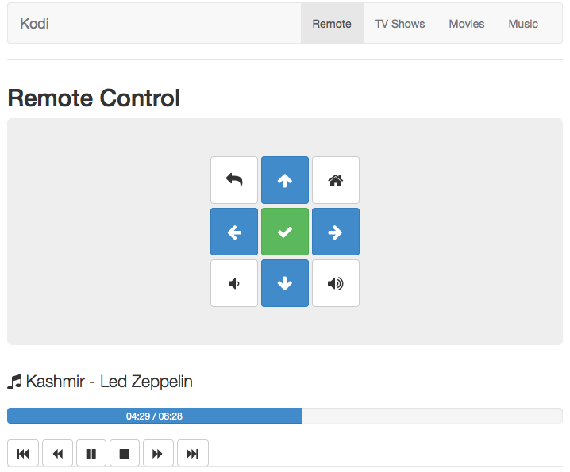
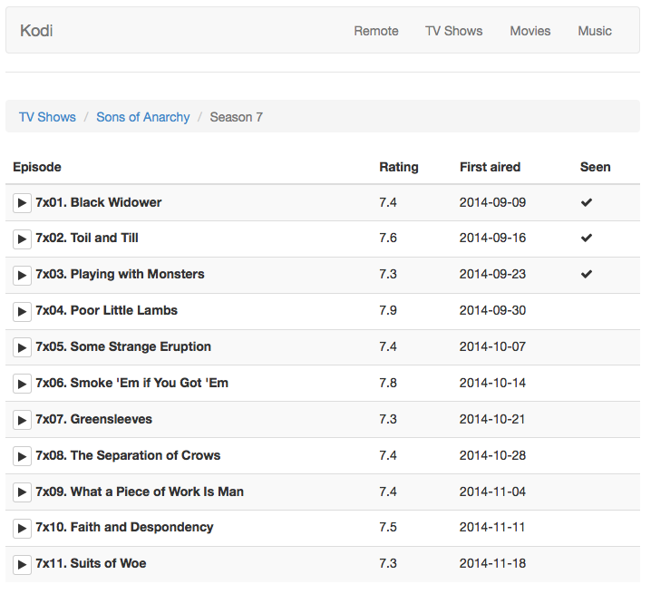

# Kodi Angular

This is a web interface for the entertainment center [Kodi](http://kodi.tv/) (formerly known as XBMC), using AngularJS framework.

There is already plenty of web interfaces available for Kodi, I just wanted to make my own, for fun!

It uses [Bootstrap](http://getbootstrap.com/) for the design, therefore it is fully responsive.

## Installation

You need to install XBMC 12.0 or upper, as it uses [Kodi JSON-RPC API v6](http://kodi.wiki/view/JSON-RPC_API) through WebSocket technology.

### On Kodi/XBMC

External control of the application must be authorize, to do so, on Kodi, go to :
> System > Services > Remote Control

And allow control for other application from both inside and outside the system.

### On your machine

You also need to install __Bower__ to install packages dependencies, and __Grunt__ to run your application with the *serve* task.

You also need to change the Constant named *KODI_URL* in app/scripts/app.js to match your Kodi IP address.

## Available features

For now, this project integrates :

- Remote control (move, back, home button...)
- Player actions (play, pause, stop, forward, backward...)
- Volume
- Movies
- TV Shows
